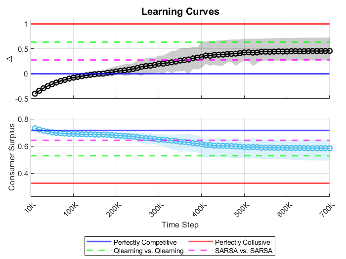
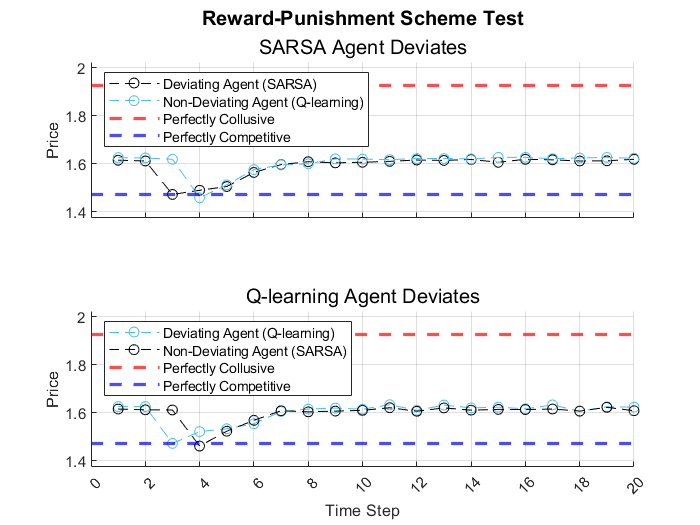
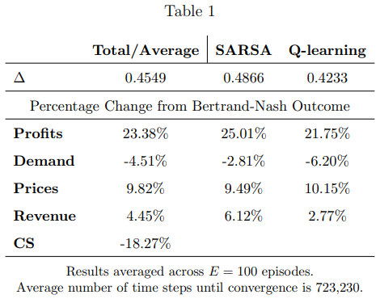
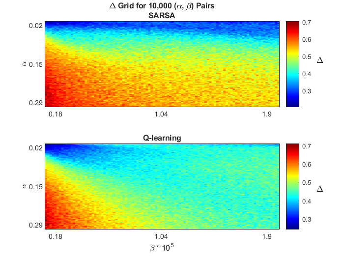

# Asymmetric Multi-Agent Reinforcement Learning Pricing Competition

Hi there! Thank you for checking out my repository! This README.md file gives
details on the Asymmetric Multi-Agent Reinforcement Learning Pricing Competition project
contained in this repository. For the full paper, [please click here](https://raw.githubusercontent.com/willbrasic/Asymmetric_Multi-Agent_Reinforcement_Learning_Pricing_Competition/main/When_Assymetric_Pricing_Algorithms_Collide.pdf).

## Overview

This repository contains code for allowing two distinct tabular based reinforcement learning methods,
SARSA and Q-learning, to engage in a Bertrand-Markov pricing game. The purpose of this project is to determine if such
algorithms engaging in an unknown environment can learn collusive outcomes and sustain them in equilibrium
using trigger strategies. The environment is coded in MATLAB and subsequently re-coded in C++
to gain more computing power and make use of object-oriented programming (OOP) design.

My results indicate that, indeed, simple asymmetric reinforcement learning algorithms
can learn anti-competitive outcomes by interacting with each other over time and such
outcomes can be sustained via using reward-punishment schemes. 

## Table of Contents

- [Asymmetric Multi-Agent Reinforcement Learning Pricing Competition](#project-name)
  - [Overview](#overview)
  - [Table of Contents](#table-of-contents)
  - [Getting Started](#getting-started)
    - [Description of Repository](#description-of-repository)
    - [Prerequisites](#prerequisites)
    - [Installation](#installation)
  - [Results](#results)

  ## Getting Started

  Below are some instructions on how to get the project up and running.

  ### Description of Repository

  The Repository contains four main folders: Logit_Equilibrium, Paper, SARSA_Qlearning_Base_Case,
  SARSA_Qlearning_C++_OOP, and SARSA_Qlearning_C++_Heat_Map.

  The Logit_Equilibrium folder contains code for finding the purely
  competitive and collusive outcomes when using a logit model of demand.
  Such outcomes are found using fixed-point iteration. This folder is needed
  to run the MATLAB script outlined next.

  The Paper folder contains the paper for this project.

  SARSA_Qlearning_Base_Case contains the code SARSA_Qlearning_Base_Case.m to
  replicate the baseline results in MATLAB as well as the plotting script
  SARSA_Qlearning_Results.m to generate the plots for the baseline model.

  SARSA_Qlearning_C++_OOP contains a much neater implementation of
  SARSA_Qlearning_Base_Case.m used in MATLAB. In this version, I leverage
  object-oriented programming (OOP) design in C++ to create a concise
  version of the environment. I construct an agent superclass and proceed
  to create SARSA and Q-learning subclasses. Such an implementation allows for
  inheritance, encapsulation, and polymorhpism, all of which I take advantage of
  when writing my code. Given the increased computing power of C++,
  this code runs much faster relative to MATLAB when
  optimizing the compiler for speed by using -0fast (see CMakeLists.txt).

  Lastly, SARSA_Qlearning_C++_Heat_Map constructs the environment in C++
  using procedural programming with a focus on optimizing for speed. The purpose
  of the code in this folder is to run the experiment over 10,000 different
  combinations of the learning rate α and the epsilon-greedy
  experimentation parameter β. The results for each parameter combination are
  subsequently averaged over one-hundred episode runs and these results are
  used to construct heat maps. I write these outcomes to a .csv file and
  subsequently construct these heat maps in MATLAB.

  ### Prerequisites

  The main dependencies are any recent version of MATLAB and version 11 or greater
  of C++.

  ### Installation

  ```bash
  # Clone the repository
  git clone https://github.com/willbrasic/Asymmetric_MARL_Pricing_Competition.git

  # Navigate to the project directory
  cd Heterogeneous_MARL_Pricing_Competition
  ```

  ## Results

  Below are training curves for the profit measure Δ (defined in the paper) and
  consumer surplus. Evidently, by interacting with each other in the foreign
  environment, these algorithms can learn anti-competitive outcomes given
  enough time.

  

  Furthermore, the next image demonstrates that each algorithm can successfully
  implement reward-punishment schemes. A pricing deviation at time step t = 3 by
  SARSA (Q-learning) is met with a swift punishment by Q-learning (SARSA) in t = 4.
  Subsequently, prices return to their anti-competitive pre-deviation level
  shortly thereafter.

  

  Next, the results of Table 1 show the profit gain measure Δ as well as
  percentage changes going from the one-shot Bertrand-Nash outcome to
  those levels averaged across the last 100,000 time steps prior to convergence
  across all episodes. This gives further evidence to the algorithms learning
  collusive strategies that result in higher profits for each agent, while
  concurrently diminishing consumer welfare.

  

  Lastly, I show the heat map for the 10,000 different (α, β) pairs.

  
